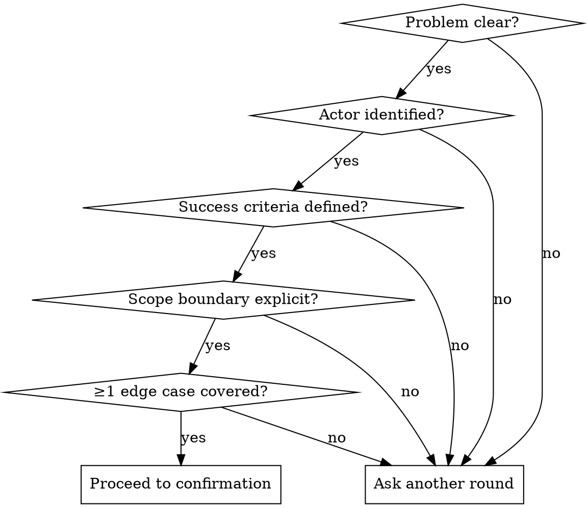

# Clarify

## Overview

Structured requirements clarification through iterative dialogue. Surfaces ambiguities before any implementation begins, converges on a shared understanding, then hands off to OpenSpec for formal spec creation.

## Input

Accepts either:
- **Purpose statement**: Free-form description of what to build
- **Jira ticket key**: e.g. `SAL-123` — fetch details using Atlassian MCP (`mcp__claude_ai_Atlassian__getJiraIssue`) or `jira issue view <KEY>` as fallback

## Step 1 — Build Base Context

Before asking any questions:

1. If Jira key provided → fetch ticket (description, acceptance criteria, comments)
2. Use `code-review-graph` MCP tools to understand relevant codebase context:
   - `semantic_search_nodes` to find related code
   - `get_architecture_overview` if touching a major subsystem
   - `query_graph` to find callers/dependents of affected areas
3. Use gathered context to ask *informed* questions — avoid asking things the code already answers

## Step 2 — Discovery Rounds

Ask **3–20 targeted questions per round**. Cover these dimensions, prioritizing gaps:

| Dimension | What to surface |
|-----------|----------------|
| **Problem** | What breaks or is missing today? Who is affected? |
| **Actor** | Who or what system initiates this? |
| **Success criteria** | How do we know it's done? Measurable outcome? |
| **Scope** | What's explicitly in scope? What's out of scope? |
| **Constraints** | Tech stack, deadlines, dependencies, compliance limits |
| **Edge cases** | Failure paths, concurrent scenarios, rollback behavior |

**Rules:**
- Max 20 questions per round, minimum 3 — scale to complexity
- Build on previous answers, never repeat covered ground
- If an answer opens new ambiguity, follow up next round
- Use codebase context to skip questions the code already answers

## Step 3 — Check Convergence

After each round, assess:



## Step 4 — Confirmation

Present agreed understanding for review:

```
## Agreed Understanding

**Problem**: ...
**Actor**: ...
**Goal**: ...
**In scope**: ...
**Out of scope**: ...
**Success criteria**: ...
**Key edge cases**: ...
**Constraints**: ...
```

Ask: *"Does this capture what we agreed? Reply 'ok' to proceed, or correct anything."*

**Do NOT proceed until the user explicitly says "ok" (or equivalent confirmation).**

## Step 5 — Hand Off to OpenSpec

After confirmation, remind the user:

> "Requirements are clear. Run `/mina:openspec-aware` (or `mina:spec-to-plan`) with the agreed understanding above to create the formal spec."

Optionally offer to pass the summary as context input to the skill.

## Common Mistakes

- **Skipping code-review-graph** — always check codebase context before asking; many questions are already answered in the code
- **Asking without reading Jira** — if ticket key given, always fetch first
- **Proceeding before explicit "ok"** — user must confirm; don't interpret silence as agreement
- **Too many or too few questions** — ask 3–20 per round based on complexity; don't pad, don't cut prematurely
- **Repeating answered questions** — track what's been covered, move forward